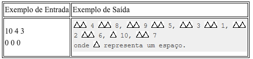
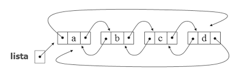
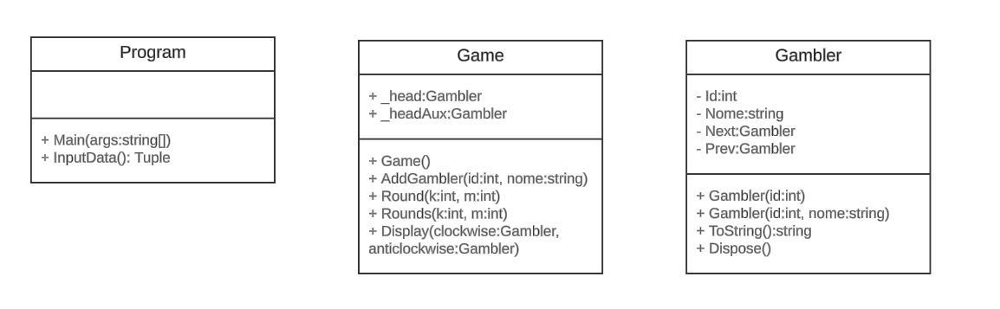

# Cassino
 Nos cassinos da Romênia, apostadores serão colocados em um grande círculo, voltados para dentro. Alguém é escolhido arbitrariamente como número 1, e os outros são numerados no sentido horário até N (os quais estarão à esquerda do 1°). Partindo do 1° e movendo-se no sentido horário, um funcionário do cassino conta k posições e retira um apostador, enquanto outro funcionário começa a partir de N e se move no sentido anti-horário, contando m posições e retirando outro apostador. Os dois que são escolhidos são então reEmovidos do círculo e se ambos os funcionários escolherem a mesma pessoa, ela (ele) ganha um brinde exclusivo do cassino. Cada funcionário, em seguida, começa a contar novamente com a pessoa próxima disponível e o processo continua até que não reste ninguém, os últimos selecionados são os ganhadores. Note-se que os dois apostadores deixam o anel ao mesmo tempo, por isso é possível que um funcionário conte a pessoa já selecionado pelo outro funcionário.

 **Entrada**
 
 Escreva um programa que leia sucessivamente três números (N, k e m; k, m > 0, 0 < N < 20) e determina a ordem no qual os apostadores são retirados do círculo. Cada conjunto de três números estará em uma linha distinta e o final da entrada de dados é sinalizado por três zeros (0 0 0).
 
 **Saída**
 
 Para cada conjunto de três números de entrada, imprima uma linha de números especificando a ordem na qual as pessoas são escolhidas. Liste o par escolhido partindo da pessoa escolhida pelo contador do sentido horário. Os pares sucessivos são separados por vírgula (mas não deverá haver vírgula após o último escolhido).

<div><br/></div>

<div><br/></div>

# Estrutura de Dados
Utilizamos uma lista circular duplamente encadeada, com um header para controlar as posições no sentido horário e um header auxiliar para o sentido anti-horário. Escolhemos essa estrutura porque ela facilita a navegação, inserção e remoção de nós (Gambler), conforme requerido neste jogo de cassino. O header principal (_head) rastreia a posição atual no sentido horário, enquanto o header auxiliar (_headAux) rastreia a posição no sentido anti-horário. Essa abordagem permite que o método Round mantenha uma complexidade de tempo O(n), enquanto o _head rastreia a posição no sentido horário.

<div><br/></div>

<div><br/></div>

# Diagrama UML
No início do desenvolvimento do desafio de implementação, elaboramos um diagrama UML inicial de construção das principais classes:

<div><br/></div>

<div><br/></div>

A classe Game gerencia a lógica do jogo. As propriedades _head e _headAux rastreiam a posição atual dos contadores no sentido horário e anti-horário. Os métodos AddGambler adicionam novos apostadores à lista, mantendo a estrutura circular. O método Round executa uma rodada de remoção de apostadores, enquanto Rounds executa várias rodadas até que todos os apostadores sejam removidos. O método Display exibe os resultados das rodadas. Temos uma função tratamento para casos em que os contadores se encontram na mesma posição.


# Tratamento de Exceções:
Usamos a classe DomainException para tratar entradas inválidas. A exceção é lançada quando a entrada não está no formato esperado ou quando os jogadores não foram adicionados antes de iniciar uma rodada.

Exemplos:
```
if (input.Length != 3)
    throw new DomainException("Entrada inválida. Certifique-se de fornecer exatamente três números.");

if (!int.TryParse(input[0], out int N) || !int.TryParse(input[1], out int k) || !int.TryParse(input[2], out int m))
    throw new DomainException("Entrada inválida. Certifique-se de fornecer números inteiros.");
```